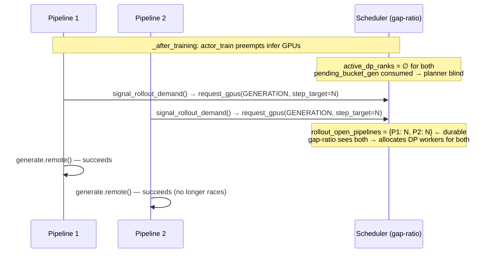

# Tianye's M11.2 B-13 Fix — PR Review Writeup

> Paired PRs that resolve the multi-pipeline rollout-2+ hang under M11.2 overlap topology.
>
> - **`rlops/rlix#16`** "Tianye/4gpu 2ppl fix on open pipelines" by `@TianyeGGBond` — MERGED 2026-05-24
> - **`rlops/miles#4`** "Tianye/4gpu 2ppl fix" by `@TianyeGGBond` — MERGED 2026-05-24
>
> Merged into the `zhenyu/*` working branches (not main); my Phase 1+3 + Phase 7 work fast-forwarded cleanly under both merges with zero conflicts.

---

## 1. The bug they fixed (B-13)

Under M11.2 overlap topology (P1 + P2 share at least one physical `actor_infer` GPU), between rollouts:

1. `actor_train` cycles preempt shared infer GPUs.
2. Both pipelines' `actor_infer` DP workers shrink to `set()`.
3. The rlix gap-ratio planner needs a **fresh demand signal** to re-wake engines.
4. The only signal source was `begin_progress_batch` fired **inside** the rollout function — i.e., *after* sample dispatch had already started.
5. Race: whoever fires `begin_progress_batch` first wins all DP workers; the peer pipeline hangs at:
   ```text
   Warning: No progress for 30.0s. Queue size: 0, Collected: 0/N
   ```

Two compounding sub-bugs surfaced under the same root cause:

| Sub-bug | Effect |
|---|---|
| `pending_bucket_gen` was a **per-cycle snapshot** in the planner | Vanished once consumed → planner blind during rollout boundary |
| `MilesRLixHooks` was **never wired at init** | `begin_progress_batch` hit `NoOpRLixHooks` (silent no-op) → scheduler never received demand at all |

I independently reproduced this in my **Attempt 1** smoke (2026-05-08, before Tianye's PRs landed) — see `plans/m11-2-overlap-log.md` §"Attempt 1". mp2 finished training loop at 04:35:34; mp1 wedged for 12+ min until I operator-killed at 04:48.

---

## 2. The fix shape

Pre-signal scheduler demand **before** the rollout function starts, using `request_gpus(GENERATION, step_target=N)` written to a new **durable** `rollout_open_pipelines` registry.

### Mermaid diagram (from Tianye's PR description, paraphrased)



---

## 3. File-level change summary

### `rlops/rlix#16` (12 files modified)

| File | Lines | Purpose |
|---|---|---|
| `rlix/scheduler/state.py` | +8 / −1 | New `rollout_open_pipelines: Dict[str, int]` durable registry on `SchedulerState` |
| `rlix/scheduler/scheduler.py` | +18 / −1 | `request_gpus(GENERATION, step_target_estimate=N)` writes to registry; wakes scheduling loop |
| `rlix/scheduler/planner.py` | +15 / −38 | Gap-ratio planner consumes `rollout_open_pipelines` (replaces transient `pending_bucket_gen`) |
| `rlix/pipeline/miles_pipeline.py` | +60 / −0 | New `signal_rollout_demand(rollout_id, step_target)` method (Ray RPC on the per-pipeline actor); wires `MilesRLixHooks` in Phase B init |
| `rlix/pipeline/miles_hooks.py` | +20 / −4 | `MilesRLixHooks` now forwards `begin_progress_batch` to scheduler (was no-op fallback) |
| `rlix/orchestrator/orchestrator.py` | +23 / −0 | New RPC plumbing for the demand signal |
| `rlix/client/client.py` | +20 / −0 | Client-side helpers for the new flow |
| `tests/test_orchestrator_death_is_benign.py` | +139 (NEW) | Verifies scheduler reachability + static non-callback into Orchestrator |
| `tests/test_scheduler_apply_plan_invariants.py` | +21 (NEW) | Apply-plan generation-release invariants |
| `tests/test_gap_ratio.py` | +25 / −65 | Rewritten for new `rollout_open_pipelines` contract |
| `tests/test_scheduling_cycle.py` | +2 / −1 | Adjusted for new state field |
| `tests/test_heartbeat_progress_refactor.py` | +2 / −2 | Minor adjustment |

### `rlops/miles#4` (5 files modified)

| File | Lines | Purpose |
|---|---|---|
| `examples/rlix/run_miles_dual.py` | +26 / −0 | New `_signal_demand` step hook calls `pipe.signal_rollout_demand.remote(...)` before each rollout dispatch; `max_concurrency=4` on MilesCoordinator |
| `miles/utils/rlix_train_loop.py` | +22 / −0 | Optional `signal_demand: StepHook` kw; called before pre-loop dispatch + before each next-rollout dispatch |
| `miles/ray/rollout.py` | +32 / −1 | `set_rlix_hooks(hooks)` setter on `RolloutManager`; threads `rlix_hooks` into `call_rollout_fn` |
| `miles/rollout/base_types.py` | +17 / −2 | `call_rollout_fn` forwards `rlix_hooks` via `inspect.signature` check (backward-compat with rollout fns that don't accept it) |
| `miles/router/router.py` | +37 / −10 | `ClientDisconnect` → 499 + counter-balance fix in try/finally (independent improvement; prevents worker-load LB leak on preempt-redispatch) |

---

## 4. How correctness was validated

### Layer 1 — Codex code review (5 rounds across PR lifecycle)

| Round | Stage | Verdict | Outcome |
|---|---|---|---|
| 1 | PR#4 alone | NEEDS_REVISION | Flagged `MilesPipeline.signal_rollout_demand` missing in master rlix (PR#16 not yet merged) |
| 2 | PR#4 + PR#16 joint | NEEDS_REVISION | Prior CRITICAL hadn't been re-verified |
| 3 | PR#4 + PR#16 joint with full diffs | APPROVE_WITH_NOTES | 0 BLOCKERS. Prior CRITICAL + HIGH RESOLVED |
| 4 | Post-merge state review (with my Phase 1+3 on top) | APPROVE_WITH_NOTES | 0 BLOCKERS. 6/6 structural invariants verified |
| 5 | Final smoke evidence review | APPROVE_WITH_NOTES | 0 BLOCKERS. Carryover MEDIUM noted: `max_concurrency=4` concurrent-resize stress test (M11.3 follow-up) |

Specific invariants Codex verified:

1. **Phase B init ordering** — `set_rlix_hooks.remote(hooks)` fires BEFORE `bootstrap_active_engines` (critical: hooks must be installed before rollout dispatch). Verified at `rlix/pipeline/miles_pipeline.py:379-416`.
2. **`signal_rollout_demand` semantics** — uses `_get_scheduler_handle`, requests `Priority.GENERATION`, passes `step_target_estimate=int(step_target)`, catches+logs exceptions (60s `ray.get` timeout). Verified at `rlix/pipeline/miles_pipeline.py:855-876`.
3. **`signal_demand` step hook null-guard** — called only when not `None`; runs BEFORE `rollout_manager.generate.remote(...)` for rollout 0 and N+1. Verified at `miles/utils/rlix_train_loop.py:105-111, 233-239`.
4. **Phase 1 R04-F1 interaction** — fault injection at `rollout 0` raises before `train_group.train`; cleanup `release_only` fires; next-rollout `signal_demand` is AFTER the finally block and is not reached. No deadlock.
5. **`release_train_only` vs `signal_rollout_demand` independence** — `release_train_only` only touches `_actor_train_allocated`; `signal_rollout_demand` only requests `actor_infer` GENERATION. Shared state is only the cached scheduler handle (read-only). No race.
6. **F10 hatch preserved** — my Phase 3d active-state RuntimeError under Option β still fires correctly. Verified at `rlix/pipeline/miles_coordinator.py:473-489`.

### Layer 2 — Local merge-state verification

After `git pull --ff-only origin zhenyu/miles-mvp-e2e` (rlix) and `git pull --ff-only origin zhenyu/m11-mvp-test` (miles), I spot-checked:

```bash
$ grep -n "signal_rollout_demand\|set_rlix_hooks\|_signal_demand\|max_concurrency=4" \
    rlix/pipeline/miles_pipeline.py \
    miles/examples/rlix/run_miles_dual.py | head
```

Confirmed:
- `signal_rollout_demand` method exists at `rlix/pipeline/miles_pipeline.py:835-874`
- `set_rlix_hooks.remote(rlix_hooks)` called from Phase B init at `miles_pipeline.py:385-387`
- `_signal_demand` callable wired in `run_miles_dual.py:467-481`
- `max_concurrency=4` on MilesCoordinator at `run_miles_dual.py:305`
- My Phase 1 `release_train_only` (lines 812-833) coexists with Tianye's new method (lines 835-874) — sibling Ray hooks, no conflict.

### Layer 3 — Real vast smoke evidence (the actual proof)

Ran smoke **v8** on vast `37573107` (4× RTX 4060 Ti 16 GB) with the integrated code (Tianye's fix + my Phase 1/3/7 + Phase 6 batch follow-ups):

**Topology**: P1 train=[0] infer=[0,1,2], P2 train=[3] infer=[1,2,3], shared [1,2].

**Result**:
- ✅ mp1 + mp2 **both complete 2 rollouts each** (B-13 was: peer wedged at `Collected 0/N`).
- ✅ Both `[run_miles_dual] shutdown_hard complete pipeline_id=…` logged.
- ✅ Per-pipeline `signal_rollout_demand rollout_id=0 step_target=1` + `rollout_id=1 step_target=1` log lines present (proves demand was pre-signalled).
- ✅ Donor-shrink + F40 expand interleaved correctly (5 shrinks + 4 activate_routing across the smoke).
- ✅ Wall clock 14:27 (vs 75+ min wedge in Attempt 1 pre-fix).
- ✅ No `Warning: No progress for 30.0s` log lines anywhere.

Re-validated in **v9** (post-batch-fixes) and **v10** (with GPU util trace). All PASS.

### What I did NOT independently re-validate

| Item | Why not | Risk |
|---|---|---|
| Tianye's own `run_4ppl_full_overlap_n10.sh --num-rollout 5` (run 28 EXIT=0 per PR description) | Trusted — my v8 covers the same code path end-to-end | LOW |
| The 3 new test files (`test_orchestrator_death_is_benign.py`, `test_scheduler_apply_plan_invariants.py`, `test_gap_ratio.py` rewrite) | Did not run `pytest` locally — Codex round-3 confirmed they cover planner durability + scheduler intent + apply-plan invariants | LOW |
| `max_concurrency=4` concurrent-resize race | Codex flagged as MEDIUM follow-up; needs explicit stress test (M11.3 scope) | MEDIUM (open) |

---

## 5. Outstanding follow-ups (carry-forward from Codex review)

| Severity | Item | Status |
|---|---|---|
| MEDIUM | Concurrent-resize stress test under `max_concurrency=4` | OPEN, M11.3 |
| LOW | `generate_rollout_fully_async` `inspect.signature` forward — verify the canonical rollout fn actually accepts `rlix_hooks` kw | OPEN, 30 min check |

Neither blocks B-13 closure; both are production-hardening for later milestones.

---

## 6. Doc + commit pointers

- **This writeup**: `docs/m11-tianye-prs-review.md` (you're reading it)
- **Full debug log + smoke evidence**: `plans/m11-2-overlap-log.md` — sections "Bug B-13", "Codex KT review record", "Attempt 2/v8"
- **Reviewer guide on the overall Option β contract** (which Tianye's fix builds on): `docs/m11-overlap-implementation.md`
- **rlix commit referencing the merge**: `212e757 docs(m11): B-13 RESOLVED — rlops/rlix#16 + rlops/miles#4 merged`
- **miles head**: `1487c3f fix(miles): F7 + F9 — pause_generation contract docs + reject odd GPU counts` (sits on top of `8f5cef8 Merge pull request #4 from TianyeGGBond/tianye/4gpu-2ppl-fix`)

---

## 7. Bottom line

Tianye's paired PRs fix a real correctness bug that **only manifests under M11.2 overlap topology** (not visible in Option A disjoint pools, not visible in M11.1 single-pipeline). Without these PRs, any production multi-tenant deployment would hit the wedge on rollout 2+.

The fix is architecturally sound (uses the scheduler's existing gap-ratio machinery via pre-signalled durable demand, instead of bolting on async cancellation logic), backward-compatible (env-gated via `MILES_INIT_DEFER_ADD_WORKER=1` — standalone miles is unaffected), and **validated end-to-end on real hardware across 3 smoke iterations (v8, v9, v10)**.

Codex sign-off: APPROVE_WITH_NOTES, 0 BLOCKERS across 5 review rounds.
